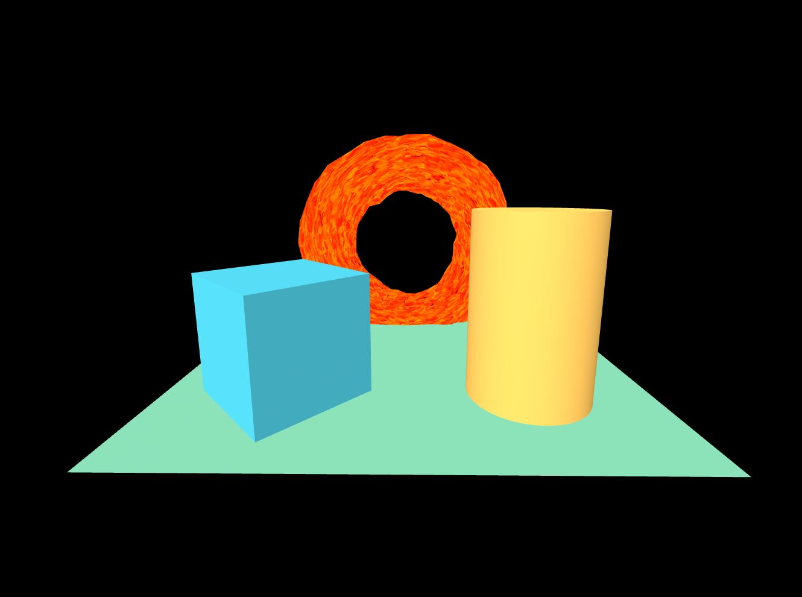

# A-Frame Component: ShaderFrog Loader (Upd)


### **Description / Rationale**
This is a component, which allows to load shaders made in ShaderFrog in A-Frame environment. This is the updated version of the component created by <a href="https://github.com/msj121/aframeFrogShaders">MSG121</a> and is compatible with A-Frame ver. 1.4.1.   

### **Instructions**
To see the component at work add "shader-frog" component to an a primitive. The component has the following attributes: 

* src: { type: 'string' } - the url to a json file, exported from ShaderFrog.

Example implementation is given below:
```
<html>
<head>
  <script src="https://aframe.io/releases/1.4.1/aframe.min.js"></script>
  <script src="js/aframe-shaderfrog-component.js"></script>
</head>
<body>
  <a-scene>
    <a-box position="-1 0.5 -3" rotation="0 45 0" color="#4CC3D9"></a-box>
    <a-cylinder position="1 0.75 -3" radius="0.5" height="1.5" color="#FFC65D"></a-cylinder>
    <a-torus canvas-updater position="0 1 -5" radius="1" shader-frog="src:url(shaders/shader9.json)">
    </a-torus>
    <a-plane position="0 0 -4" rotation="-90 0 0" width="4" height="4" color="#7BC8A4"></a-plane>
  </a-scene>
</body>
</html>
```
Please note that not all shaders are supported by this loader. Also, 3d models are not supported.
To see some shaders at work, load a shader (already exported from ShaderFrog) from shaders folder. Here is the list of shaders: 
```
    shader0 - Water Shader
    shader1 - Patterns Shader
    shader2 - Blue Glow Shader
    shader3 - Toon Shader
    shader4 - BlackWhite Line Shader
    shader5 - Smoke Shader
    shader6 - Blue Glow Shader
    shader7 - BlueWhite Line Shader
    shader8 - Sky Shader
    shader9 - Fire Shader
    shader10 - Heat Map Shader
    shader11 - Lava Shader
    shader12 - Space Shader
    shader13 - Water Waves Shader
```
If you want to use other shaders, make sure to select "Export" > "Three.js" in ShaderFrog's environment, which will export shader in JSON file format.  

### **Tech Stack**
The project is powered by AFrame and Three.js. 

### **Demo**
See demo of the component here: [Demo](https://img-particles.glitch.me/)
